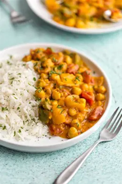

## Recipe Title
**Indian Recipe 1 – Simple Chickpea Curry (Chana Masala)**  

- Cuisine Type: Indian  
- Preparation Time: 10 min  
- Cooking Time: 20 min  
- Serving Size: 2–3  

### Ingredients (clear list with quantities)  
- Chickpeas (canned), 1 tin  
- Onion, 1 (chopped)  
- Tomato, 1 (chopped)  
- Garlic, 2 cloves (minced)  
- Curry powder, 1 tbsp  
- Oil, 1 tbsp  
- Salt, to taste  

### Method (step-by-step instructions)  
- Heat oil and sauté onion and garlic until soft  
- Add tomato and curry powder, cook for 5 minutes  
- Add chickpeas and simmer for 10–15 minutes  
- Season with salt and stir well  

### Serving Suggestions  
Serve hot with rice or flatbread (naan/roti).  

### Photo (optional)  

